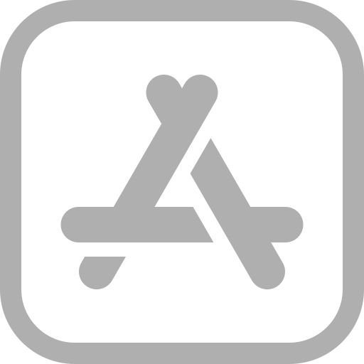
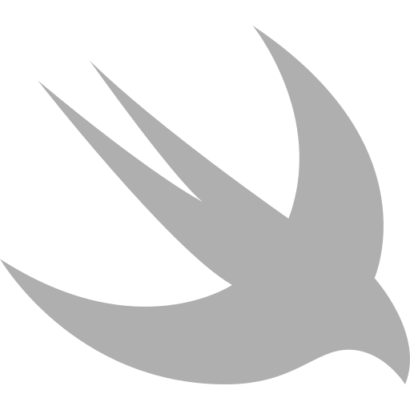
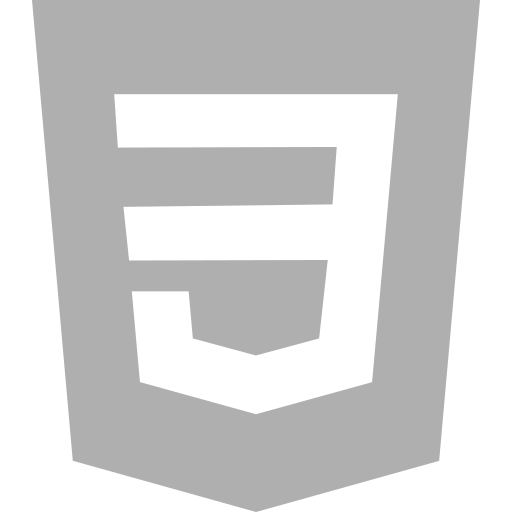
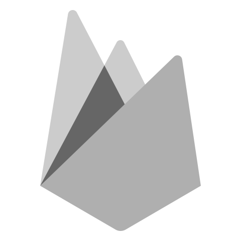

### In a Nutshell

I am an iOS Software Developer currently working at [Thirdfort](https://www.thirdfort.com). You can find out more about me on my [Site](https://tomholmes96.github.io/a-webpage-about-me/) and below are some of the projects I am currently working on.

| Project       | Description                         | Status     |
|---------------|-------------------------------------|------------|
| [AudioVisualUI](https://github.com/tommy-holmes/AudioVisualUI) | A SwiftUI implementation for a "Now Playing" bar similar to that found in music apps like Apple Music and Spotify. | In progress |

- 🔭 I’m currently working on the Thirdfort iOS app
- 🌱 I’m currently learning a lot of SwiftUI
- 📫 How to reach me: [LinkedIn](https://www.linkedin.com/in/tomholmes96/)

<h4 align='left'>Languages and Tools</h4>

