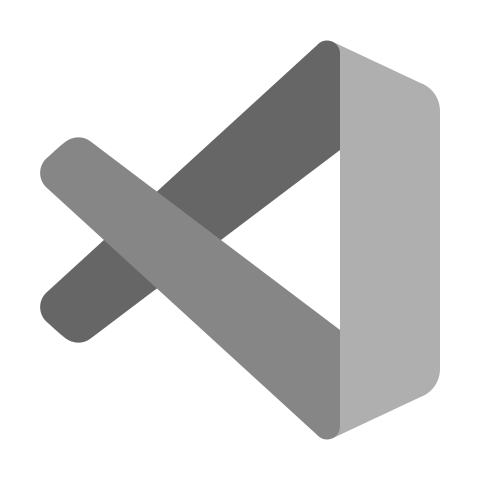
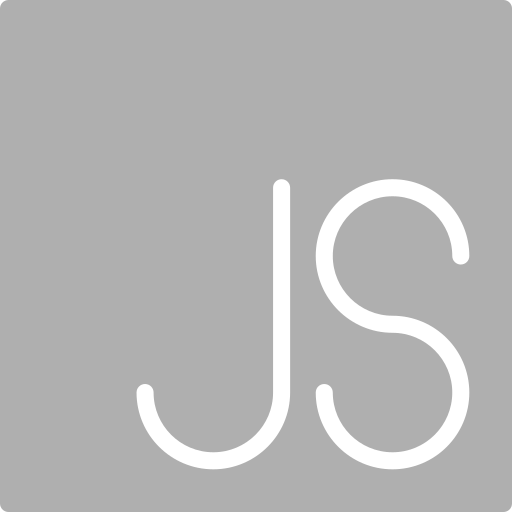

### In a Nutshell

I am an iOS Software Developer currently working at [Thirdfort](https://www.thirdfort.com). You can find out more about me and the projects I have worked on on my [Site](https://tomholmes96.github.io/a-webpage-about-me/).

- 🔭 I’m currently working on the Thirdfort iOS app
- 👨🏼‍💻 Most of my older iOS repos are still on my [GitLab](https://gitlab.com/tommy_holmes_)
- 🌱 I’m currently learning SwiftUI
- 📫 How to reach me: [LinkedIn](https://www.linkedin.com/in/tomholmes96/)

<h4 align='left'>Languages and Tools</h4>

